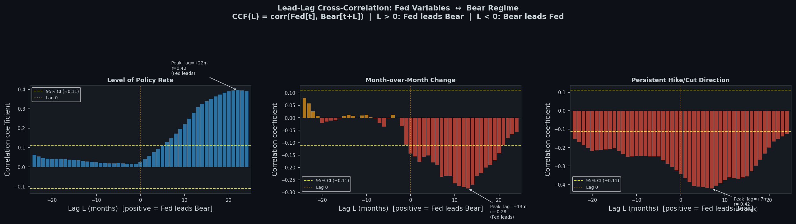
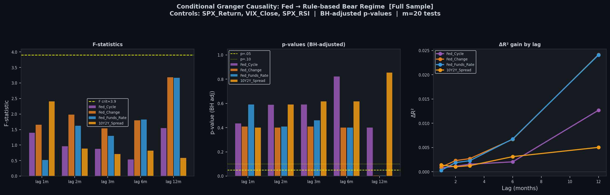
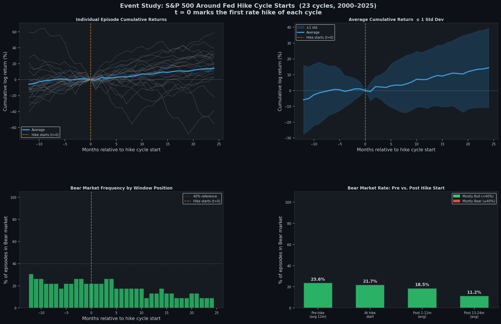
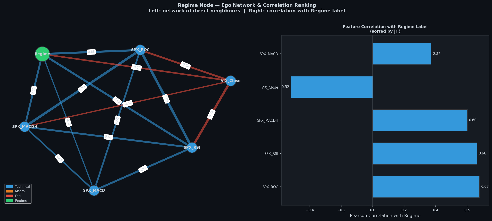
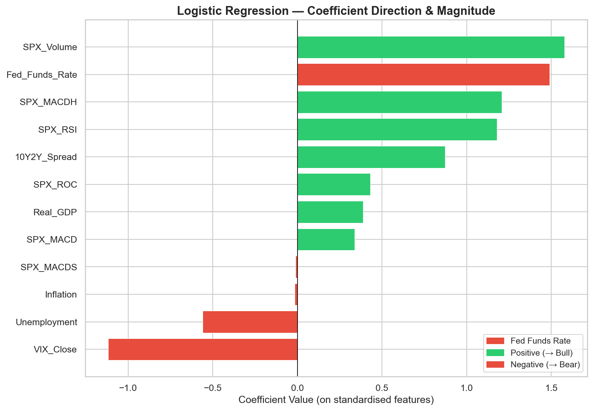
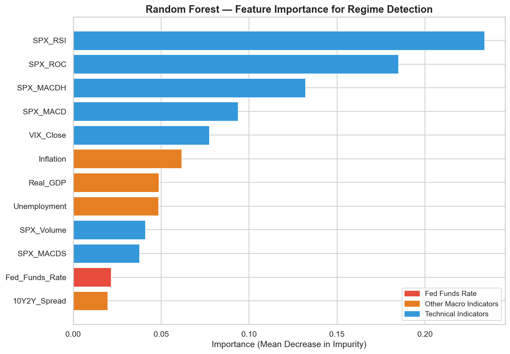
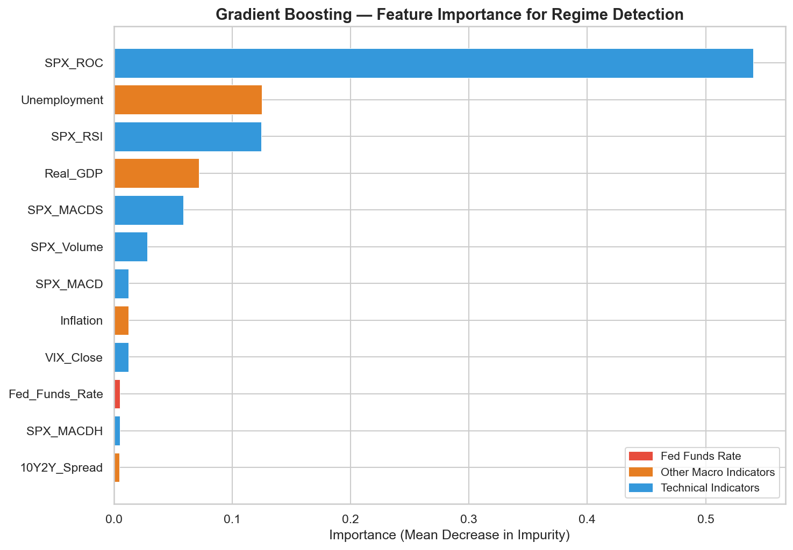

# S&P 500 Regime Detection: Data Processing and Analysis Methods

This document explains how the project dataset is constructed and how each analysis method is used to test whether Federal Reserve rate hikes are the main trigger of S&P 500 bull-to-bear regime switches.

## Dataset Overview

- **Sample period:** January 2000 to January 2026, depending on the analysis cut
- **Frequency:** Monthly
- **Primary sources:** Yahoo Finance, FRED, and selected futures data
- **Target:** Bull/bear regime label derived from S&P 500 price movements using a 20% rule

---

# Part 1. Data Processing

## 1. Monthly Alignment

### Definition

Monthly alignment converts variables from different update frequencies into a common monthly timeline.

In data science, this is used to make variables comparable, prevent high-frequency series from dominating slower macro series, and ensure all models operate on the same observation unit.

### Methodology

- Yahoo Finance market data was downloaded at monthly frequency using `interval="1mo"`.
- S&P 500 data included `SPX_Close` and `SPX_Volume`.
- VIX monthly close was added from Yahoo Finance.
- FRED macro series included:
  - `Real_GDP`
  - `Unemployment`
  - `Inflation`
  - `Fed_Funds_Rate`
  - `10Y2Y_Spread`
- Quarterly and lower-frequency FRED series were reindexed to a monthly start-of-month calendar and forward-filled.
- Futures series were converted to monthly timestamps using `to_period("M").to_timestamp()`.
- The common analysis window was filtered to `2000-01-01` through `2026-01-01`.
- For technical indicators, an earlier fetch window was used so rolling indicators were fully populated before the main sample began.

### Output / Figure

Expected output: one monthly, time-indexed dataset where technical, macro, and policy variables are synchronized on the same dates.

### Interpretation

The aligned dataset ensures that each row represents the same monthly state of the market and economy. This is essential because every later step, from feature engineering to model training, assumes that inputs and labels refer to the same time period.

## 2. Data Cleaning

### Definition

Data cleaning removes inconsistencies that would distort modelling results, including missing values, redundant variables, and leakage-prone inputs.

In data science, cleaning improves reliability, comparability, and model validity.

### Methodology

- Missing values from mixed-frequency macro data were handled by monthly reindexing and forward-filling.
- Rows with unresolved missing values after feature construction were dropped before modelling.
- Redundant variables were reduced in model-specific datasets when features overlapped heavily or served similar roles.
- `SPX_Close` was excluded from classification feature sets because the regime label is derived directly from it.
- This leakage-prevention rule was especially important for logistic regression, random forest, and gradient boosting.
- Only variables required by each analysis were kept, for example:
  - Network analysis dropped uncategorised or unused columns
  - Granger analysis dropped rows missing `SPX_Return`, `VIX_Close`, `SPX_RSI`, `Fed_Funds_Rate`, `Fed_Change`, or `bear_rule`
- Standardisation, where used, was fit on the training split only and then applied to test data.

### Output / Figure

Expected output: a cleaned monthly dataset with valid observations, consistent feature definitions, and no direct target leakage.

### Interpretation

This step makes the dataset model-ready. It ensures that any detected relationship is not an artifact of missing data handling, duplicated information, or using the target-generating price series as a predictor.

## 3. Feature Engineering

### Definition

Feature engineering transforms raw variables into signals that better capture trend, momentum, volatility, and delayed effects.

In data science, this improves the ability of models to represent mechanisms that are not visible in raw levels alone.

### Methodology

- Technical indicators were computed from monthly S&P 500 closes:
  - `SPX_ROC`: 12-period rate of change
  - `SPX_RSI`: 14-period relative strength index
  - `SPX_MACD`, `SPX_MACDH`, `SPX_MACDS`: MACD with `fast=12`, `slow=26`, `signal=9`
- Additional market features included:
  - `SPX_Return`: log return of `SPX_Close`
  - `SPX_RV_20`: 20-period rolling volatility of returns in the Granger workflow
  - `VIX_Change`: first difference of `VIX_Close` where needed
- Fed-policy features were engineered as:
  - `Fed_Change`: month-over-month difference in `Fed_Funds_Rate`
  - `Fed_Cycle`: persistent cycle direction, where hikes are `+1`, cuts are `-1`, and flat months carry forward the last direction using a `0.05` threshold
- In the advanced modelling stage described in project progress notes, additional lag and momentum features were added, including:
  - `Fed_Funds_Rate_Lag3M`
  - `Fed_Funds_Rate_Lag6M`
  - `Fed_Funds_Rate_Delta3M`
  - `Fed_Funds_Rate_Delta6M`
- The motivation was to capture delayed and cumulative monetary-policy effects rather than only contemporaneous rate levels.

### Output / Figure

Expected output: an engineered feature set containing momentum, volatility, and policy-cycle information that is more informative than raw price and macro levels alone.

### Interpretation

These engineered variables translate raw data into economically meaningful signals. They are important because later analyses show that market momentum and volatility features are often more predictive than the raw Fed rate, while lagged and delta-based Fed features can reveal delayed policy effects.

## 4. Regime Label Construction (20% Rule)

### Definition

Regime label construction turns the S&P 500 price series into a binary bull/bear classification target.

In data science, this converts a continuous market series into a supervised learning target that can be explained, tested, and predicted.

### Methodology

- Regimes were built from `SPX_Close`.
- The process started in a bull regime.
- While in a bull regime:
  - the running peak was updated when a new high was reached
  - a drop to `80%` or less of that peak triggered a switch to bear
- While in a bear regime:
  - the running trough was updated when a new low was reached
  - a rise to `120%` or more of that trough triggered a switch back to bull
- In utility code, the classifier returns `1 = Bull` and `0 = Bear`.
- In some analysis scripts, this was flipped to `bear_rule`, where `1 = Bear` and `0 = Bull`, to make interpretation more direct.

### Output / Figure

Expected output: a monthly binary regime series aligned with the feature matrix and ready for explanatory and predictive analysis.

### Interpretation

The regime label is the foundation of the project. It operationalises the research question by defining exactly when the market is considered bullish or bearish, making it possible to test whether Fed variables help explain or predict transitions.

## 5. Data Processing Summary

### Definition

This summary consolidates the final output of the data-processing pipeline.

In data science, a pipeline summary is useful because it clearly states the size, structure, and readiness of the final dataset before analysis begins.

### Methodology

- After monthly alignment, cleaning, feature engineering, and regime labelling, the project produced a unified monthly panel for downstream analysis.
- The core monthly sample covers **January 2000 to December 2025**, which gives approximately **312 monthly observations**.
- The aligned raw dataset contains **13 main variables** before adding the target label:
  - `SPX_Close`
  - `SPX_Volume`
  - `SPX_ROC`
  - `SPX_RSI`
  - `SPX_MACD`
  - `SPX_MACDH`
  - `SPX_MACDS`
  - `VIX_Close`
  - `Real_GDP`
  - `Unemployment`
  - `Inflation`
  - `Fed_Funds_Rate`
  - `10Y2Y_Spread`
- After adding the 20% rule regime label, the base modelling table contains **1 target label** plus the aligned predictors.
- In the baseline predictive-modelling workflow, `SPX_Close` is excluded to prevent leakage, leaving **12 main predictor features** for classification.
- In the advanced lag/delta experiment described in the project progress reports, the engineered feature set expanded to **23 features** before L1 pruning and was then reduced to **11 retained features**.

### Output / Figure

Expected output: a final monthly dataset that is analysis-ready, chronologically aligned, and structured for both explanatory and predictive modelling.

### Interpretation

This summary shows that the project is built on a relatively compact but information-rich monthly dataset. The sample size is appropriate for interpretable econometric checks and medium-sized classification models, while the engineered feature design allows the project to compare immediate market signals with delayed policy effects.

---

# Part 2. Analysis Models

## Analysis I: Relationship and Causality Checks

## 1. EDA / Correlation Heatmap

### Definition

Exploratory correlation analysis measures linear relationships between variables in the monthly dataset.

This is used to identify broad association patterns, detect multicollinearity, and screen which variables appear most related to the regime label before more formal analysis.

### Methodology

- Data used:
  - monthly market variables from Yahoo Finance
  - monthly macro variables from FRED
  - the 20% rule `Regime` label
  - the cleaned base feature set covering technical, macro, and Fed-related variables
- Pairwise Pearson correlation matrices were computed across the monthly feature set.
- ADF stationarity checks were used to assess whether differencing or return transformations were needed.
- Correlation heatmaps were used as a descriptive first pass rather than as a predictive test.
- The heatmap also helped motivate later leakage control and feature-pruning decisions where features appeared highly overlapping.

### Output / Figure

Outputs include a correlation heatmap showing pairwise relationships among technical, macroeconomic, and Fed-related variables.

Additional outcome reading:

- In the heatmap, the most informative result is not a single coefficient but the overall clustering pattern.
- Technical indicators such as `SPX_ROC`, `SPX_RSI`, and `SPX_MACDH` are expected to show stronger association with the regime label than the raw `Fed_Funds_Rate`.
- If the heatmap shows the Fed rate with only weak or mixed correlations to the target while technical variables form a tighter block, that means the market's internal momentum structure is more closely related to regime states than current policy levels.

### Interpretation

The heatmap provides an overview of which variables move together and which ones are structurally separate. In this project, the descriptive pattern already suggests that technical indicators and volatility are more closely linked to regime behaviour than the raw Fed Funds Rate.

## 2. Lagged Correlation Analysis

### Definition

Lagged correlation analysis tests whether a variable at time `t` is associated with the target at future or past horizons.

It is used to check whether a signal appears contemporaneous, delayed, or reactive.

### Methodology

- Data used:
  - the same monthly aligned dataset as the heatmap stage
  - engineered Fed variables including `Fed_Funds_Rate`, `Fed_Change`, and `Fed_Cycle`
  - the regime target in bull/bear or `bear_rule` form depending on the script
- Lagged correlation analysis shifted the target forward by selected horizons such as `1`, `6`, and `12` months.
- In the event-study workflow, cross-correlation was computed over `-24` to `+24` months.
- Interpretation of lag direction:
  - `L > 0`: the Fed variable leads the future bear regime
  - `L < 0`: the bear regime leads the Fed variable
- This stage was designed to distinguish immediate effects from delayed or cumulative ones.

### Output / Figure

Outputs include lead-lag cross-correlation profiles showing where correlations peak over time.

Additional outcome reading:

- The lead-lag chart shows that `Fed_Funds_Rate` peaks around **+22 months** with a positive correlation of about **0.40**, which suggests a long-delay association rather than an immediate trigger.
- `Fed_Change` peaks around **+13 months** with a **negative** correlation of about **-0.28**, meaning rate increases are associated with fewer bear markets one year later, not more.
- `Fed_Cycle` is negative across the panel and peaks around **+7 months** at about **-0.42**, showing that active hiking cycles are more closely associated with bull-market conditions.
- The key message of the figure is that the strongest relationships occur with delay or with the opposite sign of the trigger hypothesis.

### Interpretation

The lagged-correlation results suggest that any Fed effect is more delayed and cumulative than immediate. They also help show that some observed Fed-market relationships may reflect the Fed reacting to market conditions rather than causing them contemporaneously.

## 3. Conditional Granger Causality

### Definition

Conditional Granger causality tests whether past values of one variable improve prediction of a target after controlling for other relevant variables.

It addresses the question: does the Fed add incremental explanatory power beyond market information already available?

### Methodology

- Data used:
  - monthly `bear_rule` target derived from `SPX_Close`
  - market control variables `SPX_Return`, `VIX_Close`, and `SPX_RSI`
  - candidate Fed and macro cause variables `Fed_Cycle`, `Fed_Change`, `Fed_Funds_Rate`, and `10Y2Y_Spread`
- The analysis used the cleaned monthly dataset built from Yahoo Finance and FRED inputs.
- Target: `bear_rule`
- Control variables:
  - `SPX_Return`
  - `VIX_Close`
  - `SPX_RSI`
- Candidate cause variables:
  - `Fed_Cycle`
  - `Fed_Change`
  - `Fed_Funds_Rate`
  - `10Y2Y_Spread`
- Tested lags: `1`, `2`, `3`, `6`, and `12` months
- Restricted model:
  - past target values
  - lagged controls
- Unrestricted model:
  - restricted model plus lagged cause variable
- Evaluation metrics:
  - `F` statistic
  - p-value
  - Benjamini-Hochberg adjusted p-value
  - `R^2` gain between restricted and unrestricted models
- The broader script also used a chronological train/test separation around `2013-01-01` to avoid leakage in scaling and HMM-based comparisons.

### Output / Figure

Outputs include lag-by-lag conditional causality heatmaps and model-comparison charts summarising incremental explanatory gain.

Additional outcome reading:

- The conditional Granger figure should be read by focusing on which Fed variables remain significant after controlling for `SPX_Return`, `VIX_Close`, and `SPX_RSI`.
- In this project, the main outcome is that most cells are weak, insignificant, or practically small once market controls are included.
- The accompanying model-comparison result shows that the additional explanatory gain from Fed variables is very limited, with reported `R^2` improvement peaking at only around **2.5%**.
- This means that even when a lag appears statistically interesting, it adds little practical information beyond signals already contained in market variables.

### Interpretation

The main result is that most Fed variables do not materially Granger-cause regime changes once market controls are included. Even where weak significance appears, the added explanatory value is small, supporting the conclusion that Fed hikes are not the dominant immediate trigger.

## 4. Event Study

### Definition

An event study evaluates average market behaviour around a defined event date.

Here, it tests whether the start of a Fed hiking cycle is followed by a systematic increase in bear-market conditions.

### Methodology

- Data used:
  - monthly `Fed_Funds_Rate`
  - derived `Fed_Change`
  - monthly `SPX_Close`
  - derived `SPX_Return`
  - the rule-based `bear_rule` label
- Event definition: the first rate hike after at least `3` months without a hike
- A rate cut ends the current hiking cycle
- Event window:
  - `12` months before the event
  - `24` months after the event
- For each event:
  - cumulative log return was anchored to `0` at the hike-start month
  - bear-regime flags were extracted over the full window
- Aggregate outputs included:
  - individual event return paths
  - average cumulative return
  - bear-market frequency across the event window
  - pre-/at-/post-event bear-rate comparisons

### Output / Figure

The main output is a multi-panel event-study figure showing return behaviour and bear-market frequency around hike-cycle starts.

Additional outcome reading:

- The event-study figure shows **23 hike-cycle starts** and compares market behaviour from **12 months before** to **24 months after** the first hike.
- The bear-frequency bars are especially important:
  - pre-hike average: **23.6%**
  - at hike start: **21.7%**
  - post-hike 1-12 months: **18.5%**
  - post-hike 13-24 months: **11.2%**
- This means bear-market frequency falls after hikes start instead of rising.
- The average cumulative-return line also remains positive on average, which means the first hike does not usually coincide with a market peak.
- The wide spread across episodes indicates that some cycles did end badly, but the pattern is not stable enough to support a reliable trigger interpretation.

### Interpretation

The event-study evidence indicates that bear markets do not typically begin immediately after hikes start. In many cases, markets are still strong before and around the first hike, which weakens the idea of rate hikes as a direct short-term trigger.

## 5. Network Analysis

### Definition

Network analysis represents variables as nodes and strong correlations as edges.

It helps reveal which variables cluster most closely with the regime label and whether Fed variables sit near or far from that target structure.

### Methodology

- Data used:
  - technical variables such as `SPX_ROC`, `SPX_RSI`, `SPX_MACD`, `SPX_MACDH`, `VIX_Close`, and `SPX_Volume`
  - macro variables such as `Real_GDP`, `Unemployment`, `Inflation`, and `10Y2Y_Spread`
  - the policy variable `Fed_Funds_Rate`
  - the numeric `Regime` label
- Nodes included selected technical, macro, Fed, and regime variables.
- `Regime` was created from the 20% rule and converted to numeric form.
- Pearson correlations were computed over the cleaned monthly dataset.
- Edges were drawn when `|correlation| >= 0.30`.
- Stronger edges were highlighted above `0.60`.
- A spring layout was used so more strongly related variables clustered together.
- Two views were produced:
  - full correlation network
  - regime-centred ego network

### Output / Figure

Outputs include the full feature network and a regime-focused ego network highlighting direct neighbours of the target.

Additional outcome reading:

- The network outcome is read by looking at which nodes sit closest to `Regime` and how many meaningful edges each variable has.
- Reported results show:
  - `SPX_ROC`: **+0.680**
  - `SPX_RSI`: **+0.664**
  - `SPX_MACDH`: **+0.602**
  - `VIX_Close`: **-0.520**
  - `Fed_Funds_Rate`: **-0.022**
- The full graph contains **12 nodes** and **35 edges**, while `Fed_Funds_Rate` is the least connected node with degree **3**.
- In the ego network, the direct neighbours of the regime node are mostly technical and volatility features, which means the regime structure is dominated by market-state variables rather than the Fed rate.

### Interpretation

The network structure visually confirms that momentum and volatility features sit much closer to the regime label than the Fed Funds Rate. Fed variables appear comparatively isolated, reinforcing the conclusion that they are not the strongest direct drivers of regime classification.

## Analysis II: Predictive Modelling

## 6. Feature Importance Classification

### Definition

Feature importance classification compares predictive models and ranks which variables are most useful for identifying bull and bear regimes.

It is used to answer not just whether a model predicts well, but which variables drive that prediction.

### Methodology

- Data used:
  - the monthly base classification dataset
  - `Regime` as the binary target
  - 12 baseline predictors after excluding `SPX_Close` for leakage prevention
- The baseline feature set included:
  - `SPX_Volume`, `SPX_ROC`, `SPX_RSI`
  - `SPX_MACD`, `SPX_MACDH`, `SPX_MACDS`
  - `VIX_Close`
  - `Real_GDP`, `Unemployment`, `Inflation`
  - `Fed_Funds_Rate`, `10Y2Y_Spread`
- The project compared logistic regression, random forest, and gradient boosting on the same monthly train/test split.
- Model-based rankings were then compared to see where the Fed Funds Rate sat across methods.

### Output / Figure

Outputs include cross-model rankings, model comparison summaries, and feature-importance visualisations.

Additional outcome reading:

- The most important outcome here is the **cross-model comparison** rather than any single model.
- Reported baseline results show:
  - Logistic Regression accuracy: **90.48%**
  - Random Forest accuracy: **80.95%**
  - Gradient Boosting accuracy: **80.95%**
- The `Fed_Funds_Rate` ranks:
  - **#2 / 12** in Logistic Regression
  - **#11 / 12** in Random Forest
  - **#10 / 12** in Gradient Boosting
- Its cross-model average rank is **7.7 / 12**, which means it is not consistently a top predictor.
- This outcome matters because it shows that the answer depends on model structure: the Fed rate has some linear association, but it is not robustly dominant across non-linear models.

### Interpretation

This stage provides the predictive overview for the whole modelling section. The main pattern is that technical and volatility features rank more consistently near the top, while the raw Fed Funds Rate is typically weaker in the baseline specification.

## 7. Monthly Resampling with Lag/Delta Feature Engineering

### Definition

Monthly resampling with lag/delta feature engineering extends the baseline model by explicitly representing delayed and cumulative policy effects.

It is used when the raw contemporaneous value of a variable may miss timing effects that matter for prediction.

### Methodology

- Data used:
  - the monthly-aligned base dataset
  - macroeconomic and Fed-related variables resampled to the common monthly frequency
  - engineered lag and delta features for selected policy and macro variables
- The motivation for monthly resampling was to put slower-moving macro and Fed data on a fairer footing relative to market indicators.
- Additional engineered features reported in the project notes included:
  - `Fed_Funds_Rate_Lag3M`
  - `Fed_Funds_Rate_Lag6M`
  - `Fed_Funds_Rate_Delta3M`
  - `Fed_Funds_Rate_Delta6M`
- Similar lag and momentum logic was applied to macro-related variables in the advanced experiment.
- This stage expanded the predictor set before feature selection and re-modelling.

### Output / Figure

Expected outputs include the expanded monthly feature table and model-ready lag/delta predictors for the second-round classification experiment.

Additional outcome reading:

- The key result of the monthly resampling experiment is that simple downsampling alone did **not** materially change the baseline ranking pattern.
- The more important outcome comes from the lag/delta extension: once delayed and momentum-based features are added, Fed-related information becomes more visible.
- In other words, the outcome suggests that the issue is not only frequency mismatch, but also that the economically meaningful Fed signal is embedded in **timing** and **rate-of-change**, not just in the current level.

### Interpretation

This stage is important because it tests whether the Fed effect is hidden by timing. The resulting design supports the project’s more nuanced conclusion that policy effects are not mainly immediate, but may become visible after delay and momentum engineering.

## 8. Logistic Regression

### Definition

Logistic regression is a linear classification model that estimates the probability of a binary outcome.

It is useful here because it provides an interpretable baseline and shows the direction and magnitude of each feature's association with bull or bear regimes.

### Methodology

- Data used:
  - monthly `Regime` target
  - the 12 baseline monthly predictor features after excluding `SPX_Close`
  - standardised train and test matrices derived from the chronological split
- Target: `Regime`
- Base feature set:
  - `SPX_Volume`, `SPX_ROC`, `SPX_RSI`
  - `SPX_MACD`, `SPX_MACDH`, `SPX_MACDS`
  - `VIX_Close`
  - `Real_GDP`, `Unemployment`, `Inflation`
  - `Fed_Funds_Rate`, `10Y2Y_Spread`
- `SPX_Close` was excluded to avoid leakage.
- Data was split chronologically using an `80/20` train/test split.
- Features were standardised with `StandardScaler` fit on training data only.
- Model parameter: `max_iter=2000`

### Output / Figure

Outputs include test accuracy, classification metrics, confusion matrices, and coefficient plots on standardised features.

Additional outcome reading:

- The logistic-regression coefficient chart should be read by both **magnitude** and **sign**.
- Large positive coefficients indicate variables associated with the bull class, while large negative coefficients indicate variables associated with the bear class.
- In the reported baseline results, `Fed_Funds_Rate` ranks **#2 / 12** by absolute coefficient size, which means it has a noticeable linear association with the target.
- However, this does not mean it is the trigger of bear regimes; rather, it suggests that higher rates often coexist with strong-economy bull periods in the sample.
- The same model achieved **90.48%** accuracy, but this should be interpreted together with class imbalance rather than as proof of causal importance.

### Interpretation

Logistic regression provides a transparent benchmark for which variables push the model toward bull or bear classifications. In this project, the raw Fed Funds Rate is not among the strongest coefficients, while market-based signals are more prominent.

## 9. Random Forest

### Definition

Random forest is an ensemble of decision trees trained on bootstrapped samples and random subsets of features.

It solves non-linear classification problems and is useful for ranking feature importance without assuming linear effects.

### Methodology

- Data used:
  - the same monthly baseline classification dataset as logistic regression
  - the 12 cleaned predictors excluding `SPX_Close`
  - the chronological `80/20` train/test split
- Used the same cleaned monthly features and `80/20` chronological split as the logistic model
- Standardised features were passed into the model for consistency with the shared workflow
- Key parameters:
  - `n_estimators=300`
  - `max_depth=6`
  - `class_weight="balanced"`
  - `random_state=42`
- Feature importance was measured using impurity-based importance

### Output / Figure

Outputs include test accuracy, classification report, confusion matrix, and ranked feature-importance bars.

Additional outcome reading:

- The random-forest importance chart is best read as a ranking of non-linear predictive usefulness.
- The reported top five features are:
  - `SPX_RSI` (**0.2339**)
  - `SPX_ROC` (**0.1848**)
  - `SPX_MACDH` (**0.1321**)
  - `SPX_MACD` (**0.0936**)
  - `VIX_Close` (**0.0774**)
- `Fed_Funds_Rate` ranks **#11 / 12**, which places it near the bottom of the baseline tree-model ranking.
- This means the forest relies much more heavily on momentum and volatility signals than on the current policy rate when classifying bull and bear states.

### Interpretation

Random forest captures non-linear interactions and typically ranked technical indicators above the raw Fed rate. This supports the view that market-state variables carry more immediate signal for regime detection.

## 10. Gradient Boosting

### Definition

Gradient boosting builds trees sequentially, with each new tree correcting the errors of the previous ensemble.

It is well suited to structured tabular data and can uncover non-linear relationships with strong predictive performance.

### Methodology

- Data used:
  - the same monthly baseline classification dataset
  - the 12 predictor features used across the shared model comparison
  - chronologically split train and test sets
- Used the same monthly feature matrix and chronological `80/20` split
- Trained on standardised features within the shared modelling pipeline
- Key parameters:
  - `n_estimators=200`
  - `max_depth=4`
  - `random_state=42`
- Feature importance was extracted from the fitted boosting model

### Output / Figure

Outputs include test accuracy, classification report, confusion matrix, and a ranked importance chart.

Additional outcome reading:

- The gradient-boosting importance figure plays a similar role to the random-forest chart, but it reflects a sequential tree ensemble rather than a bagged one.
- In the baseline results, Gradient Boosting achieved **80.95%** accuracy and ranked `Fed_Funds_Rate` only **#10 / 12**.
- The strongest features again come from technical momentum variables, especially `SPX_RSI` and related market-state indicators.
- Because both major tree-based models push the raw Fed rate toward the bottom of the ranking, the outcome suggests that this conclusion is stable across different non-linear modelling frameworks.

### Interpretation

Gradient boosting offered a stronger non-linear benchmark and again showed that immediate market indicators were more informative than the raw policy rate. It is useful as evidence that the main conclusion is not model-specific.

## 11. Re-modelling after L1 Pruning

### Definition

Re-modelling after L1 pruning means retraining predictive models on a reduced feature set selected by an L1-penalised logistic regression.

In data science, this is useful when lagged and engineered predictors create a larger and more collinear feature space. The pruning step keeps only the strongest signals, and the re-modelling step tests whether those retained variables improve interpretability and predictive value.

### Methodology

- Data used:
  - the expanded monthly lag/delta feature set
  - L1-selected features from the advanced engineering stage
  - re-trained random forest and gradient boosting models on the pruned dataset
- In the project's advanced feature-engineering stage, monthly lag and delta terms were added for macro and Fed variables.
- Reported engineered examples included:
  - `Fed_Funds_Rate_Lag3M`
  - `Fed_Funds_Rate_Lag6M`
  - `Fed_Funds_Rate_Delta3M`
  - `Fed_Funds_Rate_Delta6M`
- An L1-penalised logistic regression was then used to prune weak predictors before re-training tree-based models.
- According to the project progress report:
  - the feature set was reduced from `23` to `11`
  - random forest was retrained on the pruned data
  - gradient boosting was retrained on the pruned data
  - reported pruned-data accuracy was approximately `78.85%` for random forest and `84.62%` for gradient boosting

### Output / Figure

Expected outputs are the subset of retained features, updated feature rankings, and revised test performance after pruning.

Additional outcome reading:

- The main result after L1 pruning is not just dimensionality reduction, but a change in **which Fed variables survive**.
- The feature set was reduced from **23** to **11** variables.
- Only two Fed-engineered features survived the penalty:
  - `Fed_Funds_Rate_Lag3M`
  - `Fed_Funds_Rate_Delta6M`
- These retained features became materially more important than the raw current rate:
  - `Fed_Funds_Rate_Lag3M` ranked strongly in Gradient Boosting, including **#3**
  - `Fed_Funds_Rate_Delta6M` ranked strongly in Random Forest, including **#3**, and reached **#5** in Logistic Regression
- Reported post-pruning accuracy was about **78.85%** for Random Forest and **84.62%** for Gradient Boosting.
- The outcome means that once the model is allowed to represent delayed and cumulative policy effects, the Fed signal becomes more meaningful than in the raw baseline feature set.

### Interpretation

L1 pruning changed the conclusion from "the raw Fed rate is weak" to a more precise result: delayed and momentum-based Fed features matter more than the contemporaneous rate level. In the reported results, `Fed_Funds_Rate_Lag3M` and `Fed_Funds_Rate_Delta6M` survived pruning and became more informative than the raw current rate.

---

# Overall Interpretation

## How the Dataset Is Built

- Raw market, macroeconomic, and policy data are aligned to monthly frequency
- Missing values are handled through forward-fill and row filtering after feature construction
- Technical, lagged, and policy-cycle features are engineered
- A bull/bear target is created from S&P 500 price movements using the 20% rule

## How the Models Work Together

- **Correlation and lead-lag methods** screen for descriptive relationships
- **Conditional Granger causality** tests whether Fed variables add explanatory value after controls
- **Event study** checks whether hike-cycle starts coincide with future bear-market onset
- **Network analysis** shows the structural proximity of each variable to the regime label
- **Classification models** measure predictive usefulness directly
- **L1 regularization** identifies whether engineered lag/delta policy features contain signal that the raw rate misses

## Main Conclusion

Across descriptive, causal, structural, and predictive analyses, the project consistently finds that Fed rate hikes are **not the main immediate trigger** of S&P 500 bear regimes.

The strongest short-horizon signals come from market momentum and volatility features such as `RSI`, `ROC`, `MACD` components, and `VIX`. Fed-related information becomes more relevant only after additional lag and delta engineering, which suggests that monetary policy effects are more **delayed and cumulative** than immediate.
