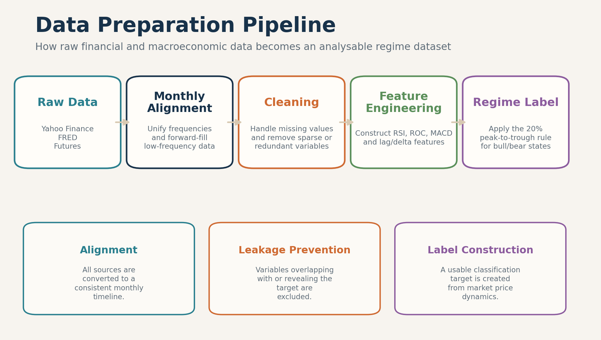
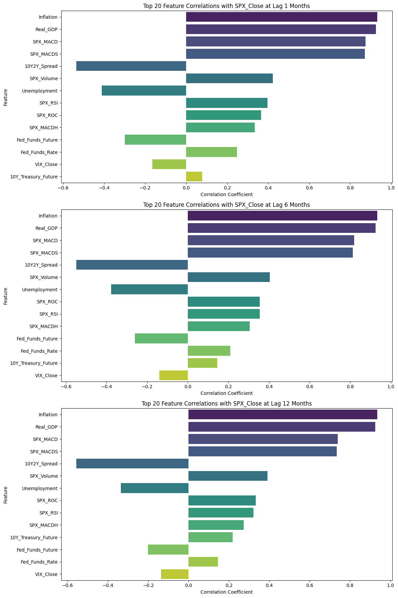
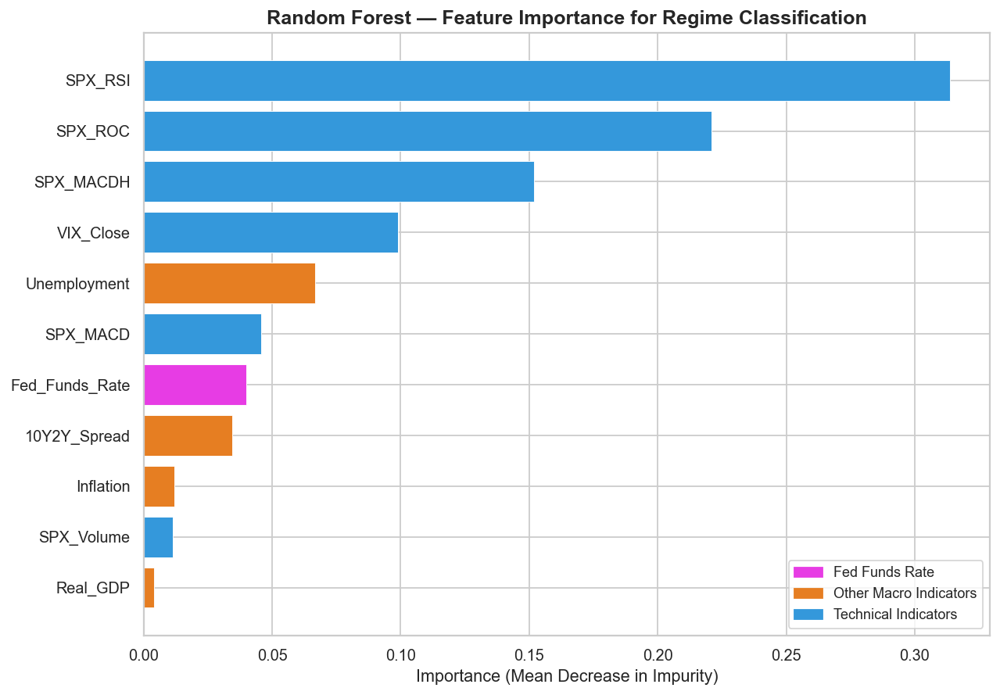
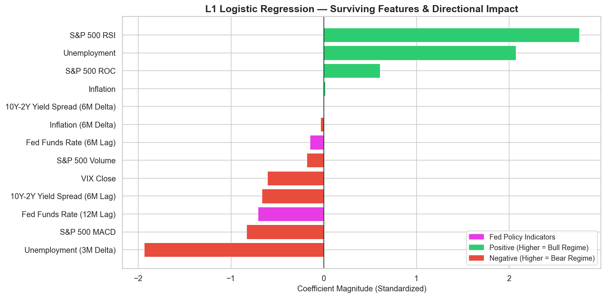
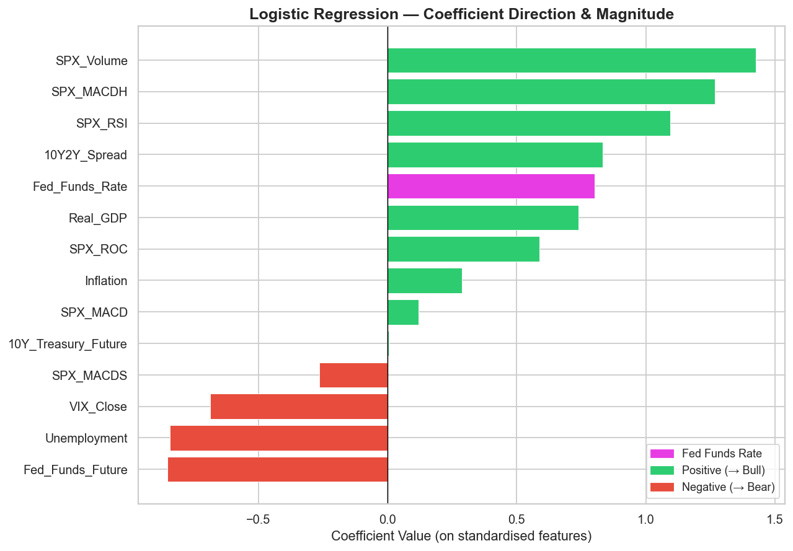
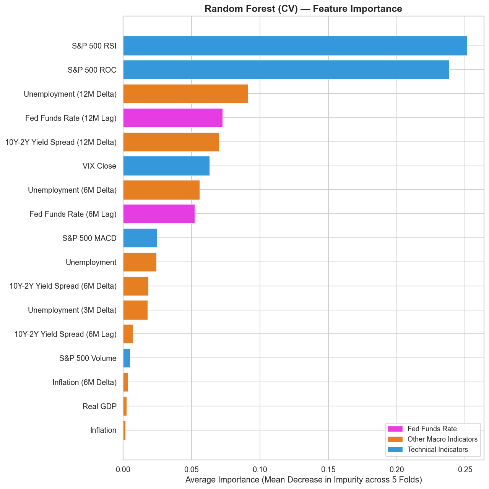

# S&P 500 Regime Detection: Data Processing and Analysis Methods

This document explains how the project dataset is constructed and how each analysis method is used to test whether Federal Reserve rate hikes are the main trigger of S&P 500 bull-to-bear regime switches.

## Dataset Overview

- **Sample period:** January 2000 to January 2026
- **Frequency:** Monthly
- **Observations:** 310 monthly rows (after cleaning)
- **Primary sources:** Yahoo Finance, FRED, and selected futures data
- **Target:** Bull/bear regime label derived from S&P 500 price movements using a 20% rule

---

# Part 1. Data Processing

## 1. Monthly Alignment

### Definition

Monthly alignment converts variables from different update frequencies into a common monthly timeline.

In data science, this is used to make variables comparable, prevent high-frequency series from dominating slower macro series, and ensure all models operate on the same observation unit.

### Methodology

- Yahoo Finance market data was downloaded at monthly frequency using `interval="1mo"`.
- S&P 500 data included `SPX_Close` and `SPX_Volume`.
- VIX monthly close was added from Yahoo Finance.
- FRED macro series included:
  - `Real_GDP`
  - `Unemployment`
  - `Inflation`
  - `Fed_Funds_Rate`
  - `10Y2Y_Spread`
- Futures series were also downloaded:
  - `Fed_Funds_Future`
  - `10Y_Treasury_Future`
- Quarterly and lower-frequency FRED series were reindexed to a monthly start-of-month calendar and forward-filled.
- Futures series were converted to monthly timestamps using `to_period("M").to_timestamp()`.
- The common analysis window was filtered to `2000-01-01` through `2026-01-01`.
- For technical indicators, an earlier fetch window was used so rolling indicators were fully populated before the main sample began.

### Output / Figure

Expected output: one monthly, time-indexed dataset where technical, macro, and policy variables are synchronized on the same dates.

### Interpretation

The aligned dataset ensures that each row represents the same monthly state of the market and economy. This is essential because every later step, from feature engineering to model training, assumes that inputs and labels refer to the same time period.

## 2. Data Cleaning

### Definition

Data cleaning removes inconsistencies that would distort modelling results, including missing values, redundant variables, and leakage-prone inputs.

In data science, cleaning improves reliability, comparability, and model validity.

### Methodology

**Dropped features and rationale:**

| Feature | Reason for Removal |
|---|---|
| `SPX_Close` | Non-stationary; regime label is derived from it (leakage); already captured by `SPX_ROC`, `SPX_RSI`, `SPX_MACD` |
| `SPX_MACDS` | Mathematically redundant — it is the 9-period EMA of `SPX_MACD` (correlation = 0.965) |
| `Fed_Funds_Future` | Near-perfect inverse correlation with `Fed_Funds_Rate` (r = −0.9999, inverse pricing convention) |
| `10Y_Treasury_Future` | 95 missing values; retaining it would force the loss of 52 monthly rows (about 4 years) |

- Missing values from mixed-frequency macro data were handled by monthly reindexing and forward-filling.
- One row with unresolved missing values after feature construction was dropped, leaving 310 rows.
- `SPX_Close` was excluded from all classification feature sets to prevent the model from directly learning the target-generating variable.

**Notable high-correlation pairs discovered:**
- `Fed_Funds_Future` ↔ `Fed_Funds_Rate`: r = −0.999966
- `Inflation` ↔ `Real_GDP`: r = 0.9898
- `SPX_MACD` ↔ `SPX_MACDS`: r = 0.9653
- `SPX_ROC` ↔ `SPX_RSI`: r = 0.7998

### Output / Figure

Expected output: a cleaned monthly dataset with valid observations, consistent feature definitions, and no direct target leakage.

No additional figure is used here; see the pipeline figure in Section 1.

### Interpretation

This step makes the dataset model-ready. It ensures that any detected relationship is not an artifact of missing data handling, duplicated information, or using the target-generating price series as a predictor.

## 3. Feature Engineering

### Definition

Feature engineering transforms raw variables into signals that better capture trend, momentum, volatility, and delayed effects.

In data science, this improves the ability of models to represent mechanisms that are not visible in raw levels alone.

### Methodology

**Stationarity transformations (applied before modelling):**

All 12 retained features were confirmed stationary (ADF test, p < 0.05) after the following transformations:

| Feature | Transformation |
|---|---|
| `SPX_Volume` | Percentage change (`pct_change`) |
| `Real_GDP` | Percentage change (`pct_change`) |
| `SPX_MACD` | First difference (`.diff`) |
| `Inflation` | Percentage change followed by first difference (`pct_change().diff()`) |
| `SPX_ROC`, `SPX_RSI`, `SPX_MACDH`, `VIX_Close`, `Unemployment`, `Fed_Funds_Rate`, `10Y2Y_Spread` | No transformation required |

**ADF stationarity test results (before transformation):**

| Feature | p-value | Status |
|---|---|---|
| `SPX_Volume` | 0.3944 | Non-stationary |
| `SPX_ROC` | 0.0010 | Stationary |
| `SPX_RSI` | 0.0299 | Stationary |
| `SPX_MACD` | 0.8662 | Non-stationary |
| `SPX_MACDH` | 0.0000 | Stationary |
| `VIX_Close` | 0.0000 | Stationary |
| `Real_GDP` | 0.9850 | Non-stationary |
| `Unemployment` | 0.0362 | Stationary |
| `Inflation` | 0.9988 | Non-stationary |
| `Fed_Funds_Rate` | 0.0012 | Stationary |
| `10Y2Y_Spread` | 0.0162 | Stationary |
| `Regime` | 0.0023 | Stationary |

All 12 features confirmed stationary after transformations.

**Engineered policy/macro lag and delta features (Experiments 2–4):**

- `Fed_Funds_Rate_Lag3M`, `Fed_Funds_Rate_Lag6M`, `Fed_Funds_Rate_Lag12M`
- `Fed_Funds_Rate_Delta3M`, `Fed_Funds_Rate_Delta6M`, `Fed_Funds_Rate_Delta12M`
- `10Y2Y_Spread_Lag3M`, `10Y2Y_Spread_Lag6M`, `10Y2Y_Spread_Lag12M`
- `10Y2Y_Spread_Delta3M`, `10Y2Y_Spread_Delta6M`, `10Y2Y_Spread_Delta12M`
- `Unemployment_Delta3M`, `Unemployment_Delta6M`, `Unemployment_Delta12M`
- `Inflation_Delta3M`, `Inflation_Delta6M`, `Inflation_Delta12M`

The motivation was to capture delayed and cumulative monetary-policy effects rather than only contemporaneous rate levels.

### Output / Figure

Expected output: an engineered feature set containing momentum, volatility, and policy-cycle information that is more informative than raw price and macro levels alone.

No additional figure is used here; see the pipeline figure in Section 1.

### Interpretation

These engineered variables translate raw data into economically meaningful signals. They are important because later analyses show that market momentum and volatility features are often more predictive than the raw Fed rate, while lagged and delta-based Fed features reveal delayed policy effects.

## 4. Regime Label Construction (20% Rule)

### Definition

Regime label construction turns the S&P 500 price series into a binary bull/bear classification target.

In data science, this converts a continuous market series into a supervised learning target that can be explained, tested, and predicted.

### Methodology

- Regimes were built from `SPX_Close`.
- The process started in a bull regime.
- While in a bull regime:
  - the running peak was updated when a new high was reached
  - a drop to `80%` or less of that peak triggered a switch to bear
- While in a bear regime:
  - the running trough was updated when a new low was reached
  - a rise to `120%` or more of that trough triggered a switch back to bull
- The classifier returns `1 = Bull` and `0 = Bear`.

### Output / Figure

Expected output: a monthly binary regime series aligned with the feature matrix and ready for explanatory and predictive analysis.

No additional figure is used here; see the pipeline figure in Section 1.

### Interpretation

The regime label is the foundation of the project. It operationalises the research question by defining exactly when the market is considered bullish or bearish, making it possible to test whether Fed variables help explain or predict transitions.

## 5. Data Processing Summary

### Definition

This summary consolidates the final output of the data-processing pipeline.

### Methodology

After monthly alignment, cleaning, stationarity transformation, feature engineering, and regime labelling, the project produced a unified monthly panel.

**Final base dataset:**
- **Rows:** 310 monthly observations (January 2000 – December 2025)
- **Features (11 predictors):**
  - `SPX_Volume` (pct_change), `SPX_ROC`, `SPX_RSI`, `SPX_MACD` (diff), `SPX_MACDH`
  - `VIX_Close`
  - `Real_GDP` (pct_change), `Unemployment`, `Inflation` (pct_change then diff)
  - `Fed_Funds_Rate`, `10Y2Y_Spread`
- **Target:** `Regime` (1 = Bull, 0 = Bear)

**Train/test splits by experiment:**

| Experiment | Type | Train | Test |
|---|---|---|---|
| Exp 1 | Holdout | 248 months | 62 months |
| Exp 2 | Holdout (with lags/deltas) | 238 months | 60 months |
| Exp 3 & 4 | Walk-Forward | Expanding | 245 months total OOS |

**Class distribution:**
- Exp 1 train: Bull = 208, Bear = 40
- Exp 1 test: Bull = 50, Bear = 12
- Walk-Forward OOS: Bull = 221, Bear = 24

### Output / Figure

Expected output: a final monthly dataset that is analysis-ready, chronologically aligned, and structured for both explanatory and predictive modelling.

No additional figure is used here; see the pipeline figure in Section 1.

### Interpretation

The project is built on a compact but information-rich monthly dataset. The bear class is relatively small across experiments, so bear-detection recall and F1-score are more informative metrics than overall accuracy.

---

# Part 2. Analysis Models

## Analysis I: EDA / Correlation Heatmap

### Definition

Exploratory correlation analysis measures linear relationships between variables in the monthly dataset.

This is used to identify broad association patterns, detect multicollinearity, and screen which variables appear most related to the regime label before more formal analysis.

### Methodology

- Data used:
  - monthly market variables from Yahoo Finance
  - monthly macro variables from FRED
  - the 20% rule `Regime` label
  - the cleaned base feature set covering technical, macro, and Fed-related variables
- Pairwise Pearson correlation matrices were computed across the monthly feature set.
- A lagged-correlation ranking against the S&P 500 target was also computed at `1`, `6`, and `12` month horizons as an initial screening step.
- ADF stationarity checks were used to assess whether differencing or return transformations were needed.
- Correlation heatmaps were used as a descriptive first pass rather than as a predictive test.
- The heatmap also helped motivate the feature removal decisions described in Section 2.

### Output / Figure

The first figure below shows the lagged-correlation ranking used to screen how strongly features remain associated with the S&P 500 target at `1`, `6`, and `12` month horizons. The second figure shows the correlation heatmap used to summarise pairwise relationships among technical, macroeconomic, and Fed-related variables.

**Notable correlation results with `Regime`:**

| Feature | Correlation with Regime |
|---|---|
| `SPX_ROC` | +0.680 |
| `SPX_RSI` | +0.664 |
| `SPX_MACDH` | +0.602 |
| `VIX_Close` | −0.520 |
| `Fed_Funds_Rate` | −0.022 |

### Interpretation

The lagged-correlation ranking and the heatmap both suggest that technical indicators and volatility are more tightly linked to regime behaviour than the raw Fed Funds Rate. Across the screening outputs, market-state variables remain more informative than the contemporaneous Fed rate. This is the first signal that Fed hikes are not the primary immediate driver.

---

## Analysis II: Predictive Modelling

The predictive modelling section uses four structured experiments to test the research question from multiple angles: holdout validation on baseline features, holdout with lag/delta engineering, walk-forward testing on macro-only data, and walk-forward testing on the full feature set.

---

## Experiment 1: Baseline Classification (Holdout Validation)

### Definition

Experiment 1 trains three classifiers on the 11-feature baseline set and evaluates them on a held-out test set to establish benchmark performance and initial feature importance rankings.

### Methodology

- Data used:
  - 310-row monthly dataset after cleaning
  - 11 predictor features (see Data Processing Summary)
  - `Regime` as binary target
- Train/test split:
  - Training: 248 months (months 1–248, up to 2013-01-01)
  - Test: 62 months (months 249–310)
  - Train: Bull = 208, Bear = 40; Test: Bull = 50, Bear = 12
- Features were standardised with `StandardScaler` fit on training data only
- Models trained:
  - Logistic Regression (`max_iter=2000`, balanced class weights)
  - Random Forest (`n_estimators=300`, `max_depth=6`, `class_weight="balanced"`, `random_state=42`)
  - Gradient Boosting (`n_estimators=200`, `max_depth=4`, `random_state=42`)
- Feature importance: absolute coefficients (LR), mean decrease in impurity (RF, GB)

### Output / Figure

The figure below shows the Random Forest feature-importance ranking from the baseline holdout experiment. The accompanying tables summarise classification performance across all three baseline models.

**Results:**

| Model | Accuracy | Bear Precision | Bear Recall | Bear F1 |
|---|---|---|---|---|
| Logistic Regression | **98.39%** | 1.00 | 0.92 | 0.96 |
| Random Forest | **83.87%** | 1.00 | 0.17 | 0.29 |
| Gradient Boosting | **88.71%** | 1.00 | 0.42 | 0.59 |

**`Fed_Funds_Rate` ranking across models:**

| Model | Rank | Out of |
|---|---|---|
| Logistic Regression | #11 | 11 |
| Random Forest | #7 | 11 |
| Gradient Boosting | #5 | 11 |
| **Average** | **7.7** | **11** |

**Top features (Random Forest):** `SPX_RSI`, `SPX_ROC`, `SPX_MACDH`, `VIX_Close`, `SPX_MACD`

### Interpretation

The raw `Fed_Funds_Rate` consistently ranks in the lower half across all three model types. Logistic Regression achieves 98.39% accuracy, but this is partly inflated by class imbalance; bear recall of 0.17 in Random Forest highlights that the model misses most bear months without threshold adjustment. Technical momentum and volatility features are the dominant predictors in the baseline.

---

## Experiment 2: Lag/Delta Engineering with L1 Feature Selection (Holdout)

### Definition

Experiment 2 extends the baseline by adding 3-, 6-, and 12-month lags and momentum deltas for Fed, spread, macro, and unemployment variables, then uses L1 regularisation to prune the expanded feature set before re-training.

### Methodology

- Data used:
  - monthly-aligned base dataset
  - 27 total features after adding lag and delta terms
- Additional engineered features included:
  - `Fed_Funds_Rate_Lag3M`, `Fed_Funds_Rate_Lag6M`, `Fed_Funds_Rate_Lag12M`
  - `Fed_Funds_Rate_Delta3M`, `Fed_Funds_Rate_Delta6M`, `Fed_Funds_Rate_Delta12M`
  - equivalent lags and deltas for `10Y2Y_Spread`, `Unemployment`, and `Inflation`
- L1-penalised Logistic Regression was applied to select predictors
- Tree models were then retrained on the pruned feature set only
- Train: 238 months; Test: 60 months (Bull = 48, Bear = 12)
- Probability threshold adjusted from 0.5 to **0.9** to improve bear recall

### Output / Figure

The figure below shows the surviving features after L1 penalisation in the monthly-resampled lag/delta experiment. The tables below summarise the pre-pruning logistic result, the L1 selection summary, and the pruned tree-model performance.

**Monthly resampling result before L1 pruning:**

| Model | Accuracy | Bear Precision | Bear Recall | Bear F1 |
|---|---|---|---|---|
| Logistic Regression | **80.00%** | 0.00 | 0.00 | 0.00 |

**L1 feature selection results:**

| Statistic | Value |
|---|---|
| Original features | 27 |
| Retained after L1 | 13 |
| Eliminated | 14 |

**Features retained after L1 pruning:**
`Unemployment_Delta3M`, `SPX_MACD`, `Fed_Funds_Rate_Lag12M`, `10Y2Y_Spread_Lag6M`, `VIX_Close`, `SPX_Volume`, `Fed_Funds_Rate_Lag6M`, `Inflation_Delta6M`, `10Y2Y_Spread_Delta6M`, `Inflation`, `SPX_ROC`, `Unemployment`, `SPX_RSI`

**Results (threshold = 0.9):**

| Model | Accuracy | Bear Precision | Bear Recall | Bear F1 |
|---|---|---|---|---|
| Random Forest | **75.00%** | 0.43 | 0.75 | 0.55 |
| Gradient Boosting | **91.67%** | 1.00 | 0.58 | 0.74 |

**Best Fed policy indicator average rank:** **4.0 / 27** (across LR, RF, GB)

### Interpretation

Monthly resampling alone does not improve bear detection: the pre-pruning logistic model predicts only the bull class. However, once delayed policy effects are represented through lags and delta terms, the best Fed feature rises from average rank 7.7 to 4.0. The L1 penalty retains `Fed_Funds_Rate_Lag6M` and `Fed_Funds_Rate_Lag12M` over the contemporaneous rate, suggesting that lagged policy features are more informative than the current rate level. Bear recall also improves substantially under the threshold = 0.9 regime in Random Forest, trading overall accuracy for better detection of bear months.

---

## Experiment 3: Macro-Only Walk-Forward Testing

### Definition

Experiment 3 tests whether Fed and macro variables alone, without any technical indicators, can predict regime switches when evaluated under walk-forward (expanding-window) cross-validation.

### Methodology

- Data used:
  - macro-only feature set: `Fed_Funds_Rate`, `10Y2Y_Spread`, `Real_GDP`, `Unemployment`, `Inflation`, plus all their lag and delta variants
  - 23 initial macro features before L1 pruning
  - `Regime` as target
- Walk-forward testing:
  - Expanding window approach; training set grows by one month at each step
  - Total out-of-sample period: **245 months**
  - Out-of-sample regime distribution: Bull = 221, Bear = 24
- L1 regularisation pruned features from 23 to 19 before tree-model training

**Features retained after L1 pruning (19):**
`Unemployment_Delta3M`, `10Y2Y_Spread`, `Fed_Funds_Rate_Lag12M`, `Unemployment_Delta12M`, `10Y2Y_Spread_Lag6M`, `10Y2Y_Spread_Delta12M`, `Fed_Funds_Rate_Lag3M`, `Fed_Funds_Rate`, `Fed_Funds_Rate_Lag6M`, `Inflation_Delta6M`, `10Y2Y_Spread_Lag3M`, `Fed_Funds_Rate_Delta12M`, `Fed_Funds_Rate_Delta6M`, `Inflation_Delta3M`, `Fed_Funds_Rate_Delta3M`, `Inflation_Delta12M`, `Real_GDP`, `10Y2Y_Spread_Lag12M`, `Unemployment`

### Output / Figure

The figure below shows the walk-forward validation setup used in the macro-only experiment. The tables below summarise out-of-sample performance and the cross-model ranking of the strongest Fed policy feature.

**Results (Walk-Forward, Pruned):**

| Model | Accuracy | Bear Precision | Bear Recall | Bear F1 |
|---|---|---|---|---|
| Logistic Regression | **82%** | 0.27 | 0.46 | 0.34 |
| Random Forest | **75%** | 0.20 | 0.50 | 0.28 |
| Gradient Boosting | **68%** | 0.15 | 0.50 | 0.23 |

**Critical finding — `Fed_Funds_Rate_Delta12M` feature rank:**

| Model | Rank | Out of |
|---|---|---|
| Logistic Regression | #4 | 23 |
| Random Forest | **#1** | 19 |
| Gradient Boosting | **#1** | 19 |
| **Average** | **2.0** | — |

### Interpretation

When technical indicators are removed, `Fed_Funds_Rate_Delta12M` (the 12-month momentum in the Fed Funds Rate) becomes the **top predictor** in both tree-based models. This is the clearest macro-only evidence in the project that the rate level itself matters less than the pace of tightening over time. However, the macro-only models produce bear precision of only 15–27%, meaning they identify fragile conditions but cannot time the exact market breakdown. This is because macro data moves too slowly to predict the precise month of the regime flip.

---

## Experiment 4: Full Feature Walk-Forward Testing (Validation Check)

### Definition

Experiment 4 reintroduces technical indicators alongside macro and lag/delta features under the same walk-forward framework as Experiment 3, serving as a validation check on whether technical indicators mask or amplify the Fed signal.

### Methodology

- Data used:
  - all features: 11 baseline + lag/delta terms = 29 total before L1 pruning
  - walk-forward expanding window; same 245-month OOS period as Experiment 3
- L1 pruning reduced from 29 to 17 features

**Features retained after L1 pruning (17):**
`SPX_MACD`, `Unemployment_Delta3M`, `Fed_Funds_Rate_Lag12M`, `VIX_Close`, `10Y2Y_Spread_Delta12M`, `10Y2Y_Spread_Lag6M`, `Unemployment_Delta12M`, `SPX_Volume`, `Fed_Funds_Rate_Lag6M`, `Inflation_Delta6M`, `Inflation`, `Real_GDP`, `Unemployment_Delta6M`, `10Y2Y_Spread_Delta6M`, `SPX_ROC`, `Unemployment`, `SPX_RSI`

### Output / Figure

The figure below shows the Random Forest (CV) feature-importance ranking from the full-feature walk-forward experiment. The tables below summarise the updated out-of-sample performance and the cross-model ranking of the strongest Fed-related indicator.

**Results (Walk-Forward, Full Features, Pruned):**

| Model | Accuracy | Bear Precision | Bear Recall | Bear F1 |
|---|---|---|---|---|
| Random Forest | **89%** | 0.43 | 0.38 | 0.40 |
| Gradient Boosting | **89%** | 0.43 | 0.38 | 0.40 |

**`Fed_Funds_Rate` best lag/delta indicator average rank:** **4.3 / 29** (across LR, RF, GB)

- Logistic Regression: #6 / 29
- Random Forest: #4 / 17
- Gradient Boosting: #3 / 17

### Interpretation

When technical indicators are reintroduced, overall accuracy rebounds to 89%, but this partly reflects the market-state information embedded in RSI and ROC. Importantly, `Fed_Funds_Rate_Lag12M` survives the L1 penalty, and Fed-related indicators still rank highly across models even in the full-feature setting. This means that the delayed Fed rate signal continues to carry independent predictive value when competing against technical momentum.

---

# Overall Interpretation

## How the Dataset Is Built

- Raw market, macroeconomic, and policy data are aligned to monthly frequency
- Non-stationary features are transformed (percentage change, first difference) before modelling
- Four features are removed: `SPX_Close` (leakage), `SPX_MACDS` (redundant), `Fed_Funds_Future` (near-perfect collinearity), `10Y_Treasury_Future` (missing data)
- Lag and delta features are engineered to capture delayed and cumulative policy effects
- A bull/bear target is created from S&P 500 price movements using the 20% rule

## How the Models Work Together

- **EDA / Correlation heatmap** screens for descriptive relationships and shows near-zero raw correlation between `Fed_Funds_Rate` and regime
- **Experiment 1** establishes that the contemporaneous Fed rate ranks last or near last in baseline classifiers
- **Experiment 2** shows that 6–12 month lagged Fed features are more informative than the current rate
- **Experiment 3** identifies `Fed_Funds_Rate_Delta12M` as the top macro predictor, but macro-only timing is poor
- **Experiment 4** confirms the lagged Fed signal survives even when technical indicators are reintroduced

## Main Conclusion

Across descriptive and predictive analyses, the project consistently finds that Fed rate hikes are **not the main immediate trigger** of S&P 500 bear regimes.

The strongest short-horizon signals come from market momentum and volatility features such as `SPX_RSI`, `SPX_ROC`, `SPX_MACDH`, and `VIX_Close`. The raw Fed Funds Rate has near-zero correlation with regime and ranks last (11/11) in the baseline logistic regression.

However, the project reveals a more nuanced picture: **it is the shock of rapid hiking**, captured by `Fed_Funds_Rate_Delta12M`, rather than the rate level, that carries the most meaningful macro signal. This effect operates with a **6–12 month delay** and is most visible when technical indicators are removed. Macro-only models can identify economically fragile conditions but cannot time the exact regime flip, because market sentiment shifts faster than the macroeconomic data that captures the policy transmission.
